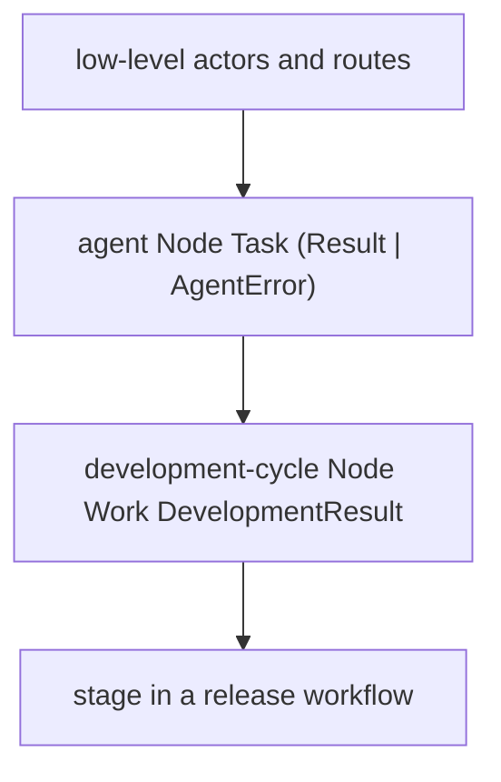
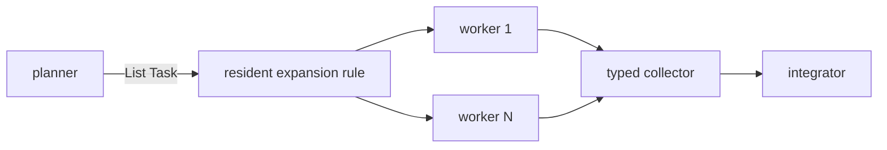
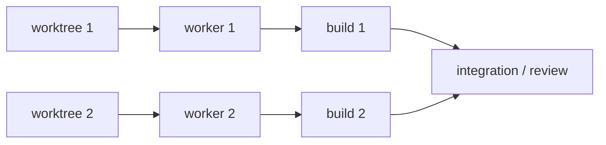

# Hierarchical Composition

Ordinary MAG functions can return nodes containing lower-level actors and
routes. The returned `Node I O` can then be bound and composed as one value.

Each layer preserves its input and output types while hiding its internal
mechanics. Lowering expands all layers into the runtime modification.

## Runtime-sized graphs

Compile-time `map` operates on values present in the source snapshot. Runtime
fan-out begins when an actor emits a list whose length was not known during
compilation.

The
[`dynamic-tasks.mag`](../../../../../examples/nefor-agent/agentic-loop/dynamic-tasks.mag)
example implements this shape. A resident pure function receives `List Task`
and returns a graph delta containing one indexed worker per item, a collector,
and their routes. A library could package the same structure as a `MapNodes`
constructor; it remains Nefor graph data rather than a MAG language primitive.

## Resources in dataflow

Each worktree node emits a typed `Worktree` value. The path is carried through
the graph to the worker and deterministic units that consume it.

The flattened runtime graph may be large; hierarchy is the authoring form and
flattening is its execution normal form.
