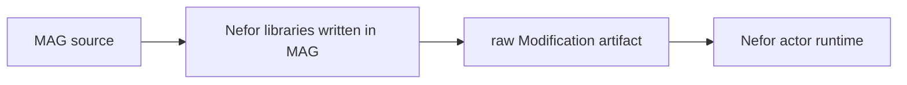

# MAG's Place Inside Nefor

Nefor's MAG libraries define graph values and two graph-modification artifact
boundaries. A complete-graph artifact describes actors, routes, initial
messages, kills, resident rules, structural types, and one result boundary. A
Delta artifact contains only the operational changes allowed against a live
run. MAG serializes the value its program supplies to `artifact`; the Nefor
runtime interprets that value.



The Nefor libraries construct and validate the artifact. The actor runtime
interprets the resulting value as a graph modification.

## Complete graphs and live changes

Authored topologies are pure `Graph -> Graph` transformations.
`nefor.artifact.compile` starts initial construction by applying the
transformation to `empty-graph`, validates the complete result, lowers it, and
returns the resulting modification as an artifact:

```lisp
(nefor.artifact.compile
  (fn [[graph nefor.graph.Graph]] -> nefor.graph.Graph
    (nefor.graph.add-edges graph
      [(nefor.graph.edge start worker)
       (nefor.graph.edge worker result)])))
```

`empty-graph` is only the initial argument at this boundary. Before compilation,
another function can accept the returned graph, add or remove edges, and return
a new graph, so graph constructors remain freely composable.

A running graph changes through an operational `Delta`, which contains only
actors, routes, messages, and kills to apply. Resident functions and explicit
`mag.apply` calls use this form:

```lisp
(let change
  (nefor.graph.delta-message
    (nefor.graph.node-delta worker)
    (get worker "input")
    task))

(nefor.artifact.delta change)
```

`Graph` transformations describe the topology used to start a run. `Delta`
values describe atomic operations against that run; they are not graph mutation
hidden inside MAG.

There are two live-change paths. A resident rule declared by the original MAG
program automatically evaluates its named pure function and applies the
returned `Delta`. Separately, Nefor's control plane can send `mag.eval` for a
resident function or `mag.apply` with a raw modification to an identified live
run.

The lead-agent `mag` tool exposes one operation across both run boundaries.
`action='apply'` without `run_id` compiles a complete graph and applies it to a
fresh run. Supplying `run_id` compiles a Delta file and submits it to that
directly dispatched live run. Application is atomic: the tool settles only
after the kernel acknowledges the complete batch of spawns, messages, and
kills. The same write gate and actor-parameter resolution used for a fresh
application also apply to newly spawned actors.

Actor identities remain immutable across live changes. An apply cannot rewrite
an existing actor, revive a killed identity, add resident rules, or replace the
run's result boundary. Replacement therefore means killing the old actor and
spawning a new actor under a new id. Any placement has to be expressible using
the new actor's routes and messages, or through indirection already present in
the running topology; apply does not rewrite routes owned by existing actors.

Resident rules remain useful when the initial program itself owns the trigger
and should react without another control-plane round trip. Explicit apply is
the corresponding path for a lead that decides during execution to extend,
signal, or retire part of its live run.

## Source and inline forms

The MAG plugin normally loads a source tree and retains its environment for
resident functions. `mag.execute` can instead receive an already constructed
artifact inline. Both forms enter the same artifact validation and execution
path; inline artifacts cannot name resident functions because no source
environment was loaded for them.

The lowered payload has the `Modification` type defined in
[`nefor/graph.mag`](../../lib/nefor/graph.mag):

```lisp
(type Modification {:actors (List LowerActor)
                    :messages (List LowerMessage)
                    :kills (List String)
                    :rules (List LowerRule)
                    :types (Map String TypeDescriptor)
                    :result ResultBoundary})
```

Concrete actors also carry factory identities, concrete type arguments,
parameters, ports, and routes. The runtime validates the complete modification
before it registers any actor.
