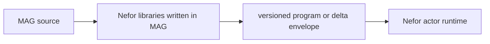

# MAG's Place Inside Nefor

Nefor's MAG libraries define node and graph values plus two explicit artifact
boundaries. A complete-graph artifact describes actors, routes, initial
messages, structural types, logical node paths, one result boundary, and any
closed declarative operations. A delta artifact contains only the operational
changes allowed against a live run. Core MAG serializes the value supplied to
`artifact`; the Nefor runtime validates and interprets the application-owned
envelope.



Most authors work with `Node<I, O>` and compose larger nodes from smaller ones.
The graph layer places the final node into a runnable topology; the actor runtime
interprets the lowered envelope.

## Complete graphs and live changes

For the common one-terminal workflow, `nefor.artifact.compile_graph` closes an
already-composed root-capable node through the ordinary output-node, graph
validation, and lowering machinery:

```mag
nefor.artifact.compile_graph(workflow)
```

At the advanced layer, authored topologies are pure `fn(Graph) -> Graph`
transformations. `nefor.artifact.compile` applies the transformation to
`empty_graph`, validates the complete result, lowers it, and returns a version-2
program envelope:

```mag
nefor.artifact.compile(
  ((|graph| => nefor.graph.add_edges(graph, [
    nefor.graph.edge(start, worker),
    nefor.graph.edge(worker, result)
  ])): fn(nefor.graph.Graph) -> nefor.graph.Graph)
)
```

Before compilation, another pure function may add or remove edges and return a
new graph. Compilation does not retrieve, mutate, or cache a stored graph.

A running graph changes through a `Delta`, which contains only actors, routes,
messages, kills, structural types, and logical paths for newly introduced nodes:

```mag
let change = nefor.graph.delta_message(
  nefor.graph.node_delta(worker),
  get(worker, "input"),
  task
)

nefor.artifact.delta(change)
```

The result is a version-2 delta envelope. The control plane may submit it with
`mag.apply` to one identified live run. Application is atomic and cannot rewrite
an existing actor, revive a killed identity, add operations, or replace the
run's result boundary. Replacement therefore uses a fresh actor id. Routes owned
by existing actors remain immutable.

Runtime-driven expansion is declared in the original program as ordered
`InstantiateDeltaTemplate` operations. Each operation subscribes to one typed
output and materializes one structural delta template through the closed
version-2 expression vocabulary. Actors still have no authority to mutate the
graph.

The lead-agent `mag-apply` tool uses the two boundaries directly. Without
`run_id` it compiles a complete graph and executes its program envelope as a
fresh run. Supplying `run_id` compiles a delta file and submits its delta
envelope to that directly dispatched live run.

## Closed immutable envelopes

`mag.load` compiles a source tree and returns the exact immutable artifact plus
its content hash for validation and preview. It retains no compiler environment
or executable function handle. The returned envelope may be stored, copied, or
executed after its source is gone.

The runtime boundary is deliberately closed:

- `mag.execute` accepts only an inline `{format: "nefor.mag", version: 1,
kind: "program"}` envelope;
- `mag.apply` accepts only an inline `{format: "nefor.mag", version: 1,
kind: "delta"}` envelope;
- raw unversioned modifications are rejected at both protocol operations; and
- a program contains one operation vocabulary, currently only
  `InstantiateDeltaTemplate` with `Trigger`, `Capture`, `Field`,
  `IntToDecimalString`, and `ConcatStrings` expressions.

Version 2 has no artifact cache, general runtime expression language,
post-compilation function application, source or bytecode payload, nested
operation, or conditional/template-programming facility.

The concrete initial payload has the `Modification` type defined in
[`nefor/graph.mag`](../../lib/nefor/graph.mag):

```mag
type Modification {
  actors: List<LowerActor>,
  messages: List<LowerMessage>,
  kills: List<String>,
  types: Map<String, TypeDescriptor>,
  nodes: List<LogicalNode>,
  result: ResultBoundary
}
```

Concrete actors also carry factory identities, concrete type arguments,
parameters, ports, and routes. The runtime validates the complete payload before
it registers any actor. `LogicalNode` carries a non-empty path of local name
segments and the runtime actor ids owned directly at that level. Parent paths
must exist, full paths must be unique, and every actor belongs to exactly one
logical node. This metadata affects inspection only; actor ids and routes remain
the execution identity.
