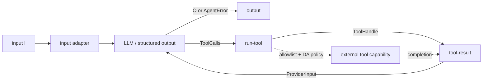

# Graphs as Library Data

[`nefor/graph.mag`](../../lib/nefor/graph.mag)
defines `Port`, `Node`, `Edge`, `Graph`, and `Program` as nominal MAG types. The
user-facing center is `Node I O`; ports and stored routes are its representation
and remain available for advanced live modifications.

## Actors

An actor is one runtime capability with a stable identity, a factory identity,
typed input and output ports, type arguments, and packed parameters. A factory
may implement an LLM request, process execution, tool coordination, a human
approval, or an adapter. The graph treats each actor as a black box whose
observable contract is its ports and messages.

Actor-specific MAG libraries define the parameter records and construct the
actors. The runtime instantiates each actor through its factory; it does not
receive one monolithic workflow configuration and infer the hidden steps.

## Node boundary

A `Node I O` composes one or more actors, their internal routes, resident rules,
and any explicit messages behind one typed input and output boundary. The
completed topology owns initial activation: every unfed `Unit` actor input gets
exactly one bootstrap message during lowering, while an incoming route or an
explicit message keeps that actor dependency-driven. The functions in
[`nefor/node.mag`](../../lib/nefor/node.mag) compose these values directly:
`>>>`, `*>`, `fanout`, `parallel`, `choose`, and `sequence`. An `Edge` connects
the final node to the surrounding topology. Compatibility is checked before the
artifact exists.

## An agent node

[`nefor.agents.with-tools`](../../lib/nefor/agents.mag) is the reusable
authoring constructor. It accepts the configuration-owned typed model resolver
and returns `Node I (O | AgentError)`. The lower-level
[`nefor.actors.agent`](../../lib/nefor/actors.mag) additionally exposes the
complete `AgentConfig`, including DA policy. Both boundaries hide the
provider/tool loop while preserving every terminal result type.

The stored node has exactly four actors: the input adapter, the LLM (or
structured-output factory), `run-tool`, and `tool-result`. `run-tool` receives
the tool allowlist and DA policy as parameters. The dashed path is capability
work outside the stored actor graph; the policy and tool execution are not two
extra actors hidden inside the node. This topology follows the implementation
in `nefor.actors.agent` linked above.

The
[`typed-task.mag`](../../../examples/nefor-agent/agentic-loop/typed-task.mag)
example composes the agent node between a source and output.
