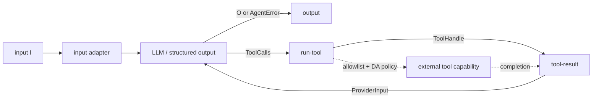

# Graphs as Library Data

[`nefor/graph.mag`](../../lib/nefor/graph.mag)
defines `Port`, `Node`, `Edge`, `Graph`, and `Program` as nominal MAG types. Its
functions construct, validate, and lower those values.

## Actors

An actor is one runtime capability with a stable identity, a factory identity,
typed input and output ports, type arguments, and packed parameters. A factory
may implement an LLM request, process execution, tool coordination, a human
approval, or an adapter. The graph treats each actor as a black box whose
observable contract is its ports and messages.

Actor-specific MAG libraries define the parameter records and construct the
actors. The runtime instantiates each actor through its factory; it does not
receive one monolithic workflow configuration and infer the hidden steps.

## Node boundary

A `Node I O` composes one or more actors, their internal routes, and initial
messages behind one typed input port and one typed output port. An `Edge`
connects two node boundaries. Edge compatibility is checked before the artifact
exists.

## An agent node

[`nefor.actors.agent`](../../lib/nefor/actors.mag)
returns `Node I (O | AgentError)`. Its public boundary hides the provider/tool
loop while preserving every terminal result type.

The stored node has exactly four actors: the input adapter, the LLM (or
structured-output factory), `run-tool`, and `tool-result`. `run-tool` receives
the tool allowlist and DA policy as parameters. The dashed path is capability
work outside the stored actor graph; the policy and tool execution are not two
extra actors hidden inside the node. This topology follows the implementation
in `nefor.actors.agent` linked above.

The
[`typed-task.mag`](../../../../../examples/nefor-agent/agentic-loop/typed-task.mag)
example composes the agent node between a source and output.
