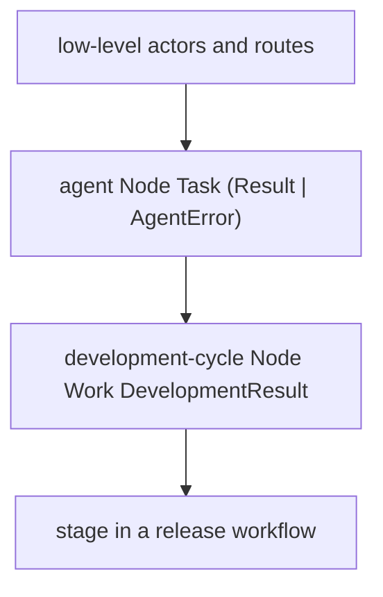
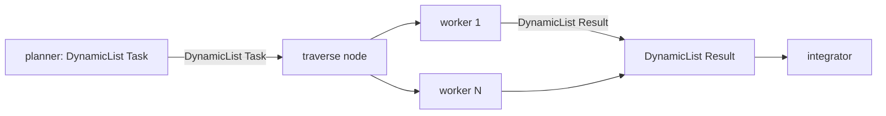
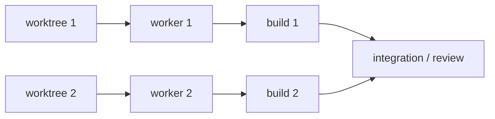

# Hierarchical Composition

Ordinary MAG functions can return nodes containing lower-level actors and
routes. The returned `Node I O` can then be bound and composed as one value.



Each layer preserves its input and output types while hiding its internal
mechanics. Lowering expands the executable work into actors and routes while
also retaining the authored node paths as presentation metadata.

The basic composition vocabulary mirrors established functional abstractions:

```text
>>>      : Node A B -> Node B C -> Node A C
*>       : Node A B -> Node Unit C -> Node A C
fanout   : Node I A -> Node I B -> Node I (A + B)
parallel : Node A B -> Node C D -> Node (A + C) (B + D)
choose   : Node A C -> Node B D -> Node (A | B) (C | D)
sequence : List (Node I O) -> Node I (List O)
```

These are library functions, not syntax or a mandatory architecture. A small
one-off workflow may stay direct. Repeated or independently meaningful pieces
can become ordinary node-producing functions, exactly as in other code.

`>>>` is hierarchy-transparent. It connects two nodes without inventing a
parent, so a long pipeline does not become a binary staircase. Use `named` only
when a function has produced a real abstraction boundary that should collapse
as one node. `rename` gives that placed value a concise local label without
rewriting its opaque runtime actor ids.

Hierarchy is represented by paths of local names:

```text
["camera-stage"]
["camera-stage" "agent"]
["camera-stage" "agent" "llm"]
["camera-stage" "retry"]
```

Every full path is unique within the run. Dots in actor ids are ordinary
characters and never imply parentage. The run itself is the display root, so
its direct children appear immediately; there is no mandatory one-node wrapper
around the complete workflow.

## Runtime-sized graphs

`sequence` covers fixed fan-out: its MAG `List` fixes producer count and result
order while compiling. `DynamicList T` is different. It is the producer-side
protocol for dynamically many indexed `T` occurrences followed by explicit
completion; it is not a runtime-sized MAG container value. Consumer operations
retain that same nominal boundary: traversal activates once per occurrence,
while context activates once with the ordered list after completion.



The
[`dynamic-tasks.mag`](../../../examples/nefor-agent/agentic-loop/dynamic-tasks.mag)
example implements this shape. `nefor.agents.dynamic-with-tools` produces the
dynamic producer effect, `nefor.agents.dynamic-template-with-tools` defines the
closed worker template, and `nefor.dynamic.traverse-template` consumes the
stream to instantiate it for each indexed occurrence. `nefor.dynamic.context`
consumes the same protocol, waits for explicit completion, and sends one ordered
provider turn to the integrator.

## Resources in dataflow



Each worktree node emits a typed `Worktree` value for an agent input. A
deterministic command's parameters are fixed when the artifact is constructed,
so the workflow binds the requested worktree path once and reuses that string
both in the worktree specification and the command's `cwd`. The worktree result
still reaches the agent through an ordinary typed edge.

The executable graph may be large, but its logical hierarchy survives lowering
for inspection. Within every set of siblings, the TUI performs a deterministic
best-effort linearization from entries toward exits. Arbitrary directed graphs
and feedback cycles remain valid: when a cycle prevents a complete topological
ordering, declaration order breaks the tie and the feedback edge points back
through the displayed sequence. This changes representation only, never runtime
scheduling.
