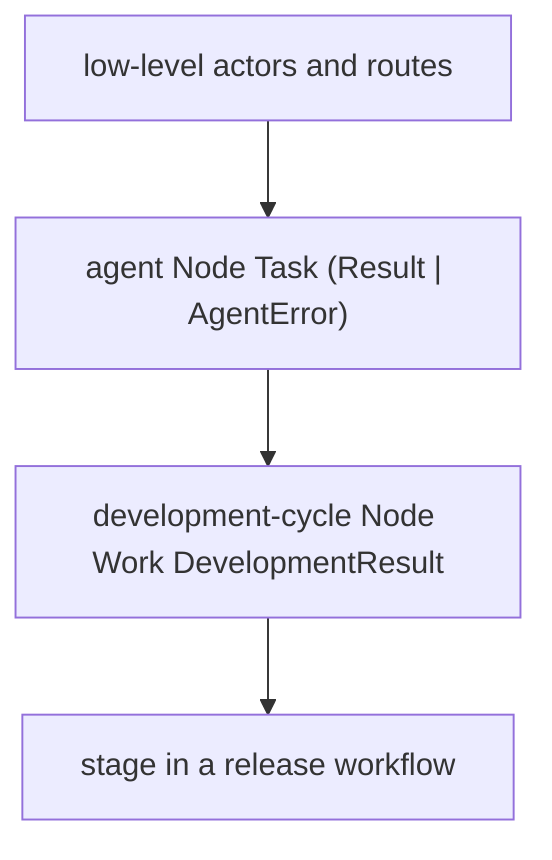
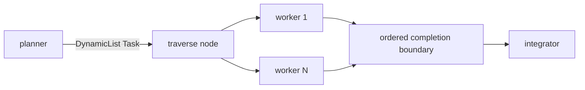
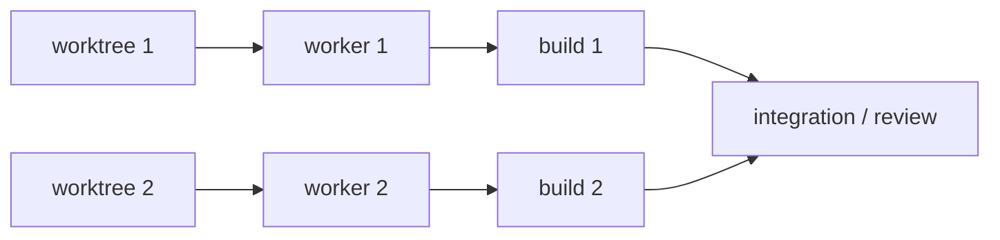

# Hierarchical Composition

Ordinary MAG functions can return nodes containing lower-level actors and
routes. The returned `Node I O` can then be bound and composed as one value.



Each layer preserves its input and output types while hiding its internal
mechanics. Lowering expands all layers into the runtime modification.

The basic composition vocabulary mirrors established functional abstractions:

```text
>>>      : Node A B -> Node B C -> Node A C
*>       : Node A B -> Node Unit C -> Node A C
fanout   : Node I A -> Node I B -> Node I (A + B)
parallel : Node A B -> Node C D -> Node (A + C) (B + D)
choose   : Node A C -> Node B D -> Node (A | B) (C | D)
sequence : List (Node I O) -> Node I (List O)
```

These are library functions, not syntax or a mandatory architecture. A small
one-off workflow may stay direct. Repeated or independently meaningful pieces
can become ordinary node-producing functions, exactly as in other code.

## Runtime-sized graphs

`sequence` covers fixed fan-out: its MAG `List` fixes producer count and result
order while compiling. `DynamicList T` is different. It describes dynamically
many ordered `T` occurrences at a node boundary when cardinality is known only
during execution; it is not a runtime-sized MAG container value.



The
[`dynamic-tasks.mag`](../../../examples/nefor-agent/agentic-loop/dynamic-tasks.mag)
example implements this shape. `dynamic-agent` produces the effect,
`dynamic.traverse` constructs one ordinary worker for each indexed occurrence,
and `dynamic.context` waits for explicit completion before sending one ordered
provider turn to the integrator.

## Resources in dataflow



Each worktree node emits a typed `Worktree` value for an agent input. A
deterministic command's parameters are fixed when the artifact is constructed,
so the workflow binds the requested worktree path once and reuses that string
both in the worktree specification and the command's `cwd`. The worktree result
still reaches the agent through an ordinary typed edge.

The flattened runtime graph may be large; hierarchy is the authoring form and
flattening is its execution normal form.
