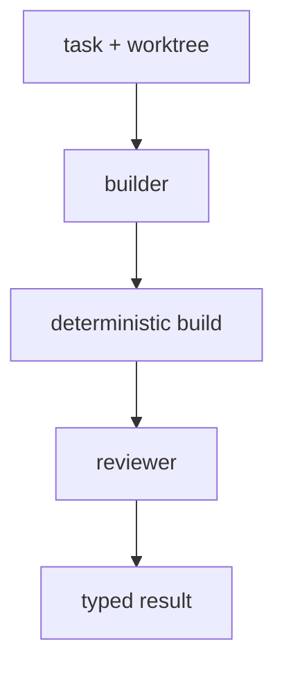

# Development Workflows

An SDLC-shaped graph demonstrates local types, node-producing functions,
deterministic capabilities, resources, and runtime expansion in one
composition.



The builder performs judgment; the process node reports deterministic build
facts; the reviewer performs a second judgment. A static pipeline composes
these as ordinary nodes. When a runtime value determines the number of new
workers, an `InstantiateDeltaTemplate` operation expands a structural delta at
that typed output.

## Project-specific code

The workflow's command, policy, result classification, and builder input are
local values. Their relationship is visible where they are defined:

```lisp
(let build-command "cargo build")

(type BuildPassed {:stdout String})
(type BuildFailed
  {:stdout String
   :stderr String
   :termination nefor.contracts.ProcessTermination})
(type BuildFeedback (adt [BuildPassed BuildPassed] [BuildFailed BuildFailed]))

(let classify-build
  (fn [[result nefor.contracts.ProcessResult]] -> BuildFeedback
    (match (get result "termination")
      [nefor.contracts.ProcessExited exited
        (if (= (get exited "code") 0)
          (as BuildFeedback
            (as BuildPassed {:stdout (get result "stdout")}))
          (as BuildFeedback
            (as BuildFailed
              {:stdout (get result "stdout")
               :stderr (get result "stderr")
               :termination
               (as nefor.contracts.ProcessTermination exited)})))]
      [nefor.contracts.ProcessSignaled signaled
        (as BuildFeedback
          (as BuildFailed
            {:stdout (get result "stdout")
             :stderr (get result "stderr")
             :termination
             (as nefor.contracts.ProcessTermination signaled)}))])))
```

The termination constructors are the branch evidence. The workflow does not
duplicate them as string fields, and exhaustive `match` keeps every process
outcome visible.

The workflow itself should be a short local node-producing function. Nefor's
shared library supplies graph, agent, process, worktree, and dynamic-expansion
mechanisms; it does not choose a project's SDLC. The complete progression is in
[Nefor MAG in Five Minutes](<00. Nefor MAG in Five Minutes.md>).

For runtime-sized work, a producer exposes `DynamicList`; use
`nefor.dynamic.traverse-template` to author the closed operation behind an
explicit `DynamicEach` consumer boundary. Use `nefor.dynamic.context` when the
consumer needs `DynamicAll` and must activate once with the ordered collection
after completion. Fixed worker lists use `nefor.node.sequence`. Feedback that
requires an arbitrary runtime program or
post-compilation function call is outside the version-1 operation model; model
that policy as an ordinary bounded node or let the control plane compile and
apply an explicit delta.

The repository examples are read-only references. During a session, the lead
writes task-specific MAG source into that session's writable workspace. Its
ambient context names the selected immutable module roots and MAG Book; neither
the libraries nor the book are copied into the session.
