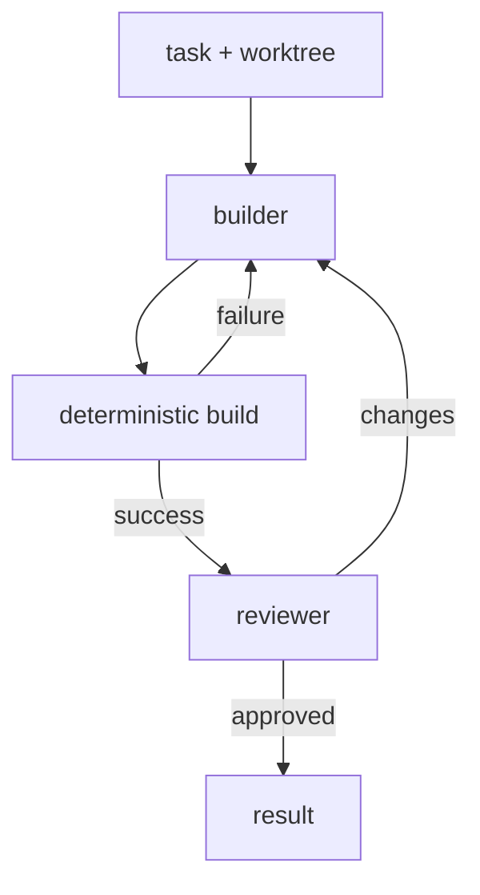

# Development Workflows

An SDLC-shaped graph demonstrates local types, node-producing functions,
deterministic capabilities, resources, and feedback cycles in one composition.



The builder performs judgment; the process node reports deterministic build
facts; the reviewer performs a second judgment. Local MAG types define which
facts return to the builder and which result completes the cycle.

## Project-specific code

The workflow's command, policy, result classification, and builder input are
local values. Their relationship is visible where they are defined:

```lisp
(let build-command "cargo build")

(type BuildPassed {:stdout String})
(type BuildFailed
  {:stdout String
   :stderr String
   :termination nefor.contracts.ProcessTermination})
(type BuildFeedback (| BuildPassed BuildFailed))

;; The process parameters and builder policy both use build-command.
;; The exact command and policy record are properties of this project.

(let classify-build
  (fn [[result nefor.contracts.ProcessResult]] -> BuildFeedback
    (match (get result "termination")
      [nefor.contracts.ProcessExited exited
        (if (= (get exited "code") 0)
          (as BuildFeedback
            (as BuildPassed {:stdout (get result "stdout")}))
          (as BuildFeedback
            (as BuildFailed
              {:stdout (get result "stdout")
               :stderr (get result "stderr")
               :termination
               (as nefor.contracts.ProcessTermination exited)})))]
      [nefor.contracts.ProcessSignaled signaled
        (as BuildFeedback
          (as BuildFailed
            {:stdout (get result "stdout")
             :stderr (get result "stderr")
             :termination
             (as nefor.contracts.ProcessTermination signaled)}))]))
```

The termination constructors are the branch evidence. The workflow does not
duplicate them as string fields inside `BuildPassed` or `BuildFailed`, and the
exhaustive `match` makes every process outcome visible in the code.

The cycle itself is a short local node-producing function. Nefor's shared
library supplies graph, agent, process, and worktree mechanisms; it does not
choose this project's SDLC. The complete compilable progression—including the
policy, worktree, process-result mapping, feedback routes, `(sdlc "...")`
boundary, and a later dynamic swarm—is the single program in
[Nefor MAG in Five Minutes](<00. Nefor MAG in Five Minutes.md>).

The repository examples are read-only references. During a session, the lead
writes task-specific MAG source into that session's writable workspace. Its
ambient context names the selected immutable module roots and MAG Book; neither
the libraries nor the book are copied into the session.
