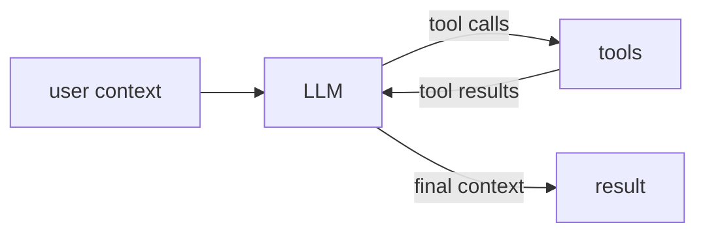

# Reasoners Is All You Need

An LLM call, script, tool, human decision, and complete workflow have different
implementations but share one external shape: each receives context and returns
context.

> **Definition 1.** A reasoner has the shape `R: Context -> Context`.

`Context` names the information boundary relevant at one composition level; it
does not require every reasoner to exchange one universal record. A typed Nefor
node may project that boundary as `Node I O` while retaining the same mental
model: it transforms the context it receives into the context it returns.

The types may differ:

- a process maps arguments to a process result;
- an LLM maps prompt and history to a response and updated history;
- a human gate maps a request to approval or rejection; and
- in a chat, a human maps the current history to a new history by writing and
  submitting the next message.

## Closure under composition

Sequential, parallel, conditional, and cyclic compositions of reasoners expose
the same outer shape. A directed graph of reasoners is therefore itself a
reasoner and can occupy one node in a larger graph.

The agentic loop is not a special category. It is a cyclic reasoner graph whose
public boundary hides the cycle.

## Static projection of a dynamic reasoner

`Context -> Context` describes one application of a fixed reasoner. Over longer time
scales, the reasoner may change too:

> **Definition 2.** A dynamic reasoner has the shape
> `r: (Context, R) -> (Context, R')`.

Nefor's graph boundary uses the static projection for composition. State owned
by actors may evolve between firings while their typed node boundary remains
stable. This keeps one composition algebra without claiming that humans,
models, or institutions are permanently pure functions.

## Why the abstraction matters

Once scripts, agents, humans, and composed workflows share one typed boundary,
they can all be constructed and composed with the same graph operations. That
is the abstraction's primary value: a complicated reasoner graph becomes one
typed node that a larger graph can reuse.

Because graphs are ordinary MAG values, MAG functions can also express rewrite
rules while constructing a topology. A function may receive a graph, remove
edges containing one reasoner, add a replacement with the same boundary, and
return the rewritten graph before execution. This is a consequence of
representing graph construction as typed data, rather than the reason the
abstraction exists. It is distinct from applying an operational `Delta` to a
live run, where existing actor identities and their routes remain immutable.

Before mechanical calculators, a bank could employ people whose role was to
turn account figures into calculated results. Those human calculator nodes were
slow and could make arithmetic mistakes, but the surrounding organization only
depended on their inputs and outputs. Once machines could satisfy the same
contract, the bank could replace those nodes without redesigning every upstream
clerk and downstream ledger process. A MAG graph transformation can describe
the analogous replacement while preserving the larger graph's typed boundary.
